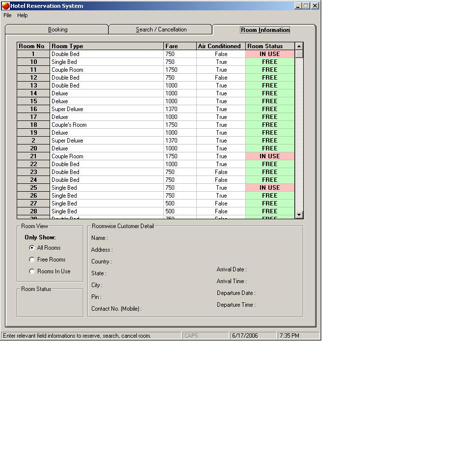



## Hotel Reservation System

### Description

It keeps the record of all the customers entering the hotel.

Database Connection :

1. Control Panel-&gt;Administrative Services-&gt;Data Sources (ODBC)

2.Under "User DSN" Tab Add a new database by clicking "Add.."

3.Select driver "Microsoft Access Driver(*.mdb)" and click "Finish"

4.Give Data Source name "hotel"

5.Click the button "Select..."

6.Search the database by pointing to the correct drive and directory

7.When the database "hotel.mdb" is shown on the left box. Select the databse and click "Ok"

8.Click "OK"

9. Now the Application is ready for run.

10.Run the file "Hotel Booking"
 
### More Info
 
Name, Address, Arrival Time, Date, Hotel Room type, Credit Card etc...

To make the data base connectivity. To connect data base through system DSN.

Stores the record in the database, and shows which room is empty and which is full. Also shows the information of the customer living in a particular room using flexgrid technique.

             |
---                |---
**Submitted On**   |2006-06-17 19:41:00
**By**             |[Suvam Rakshit](https://github.com/Planet-Source-Code/PSCIndex/blob/master/ByAuthor/suvam-rakshit.md)
**Level**          |Advanced
**User Rating**    |4.5 (18 globes from 4 users)
**Compatibility**  |VB 5\.0, VB 6\.0, VBA MS Access
**Category**       |[Complete Applications](https://github.com/Planet-Source-Code/PSCIndex/blob/master/ByCategory/complete-applications__1-27.md)
**World**          |[Visual Basic](https://github.com/Planet-Source-Code/PSCIndex/blob/master/ByWorld/visual-basic.md)
**Archive File**   |[Hotel\_Rese2001496172006\.zip](https://github.com/Planet-Source-Code/suvam-rakshit-hotel-reservation-system__1-65695/archive/master.zip)

